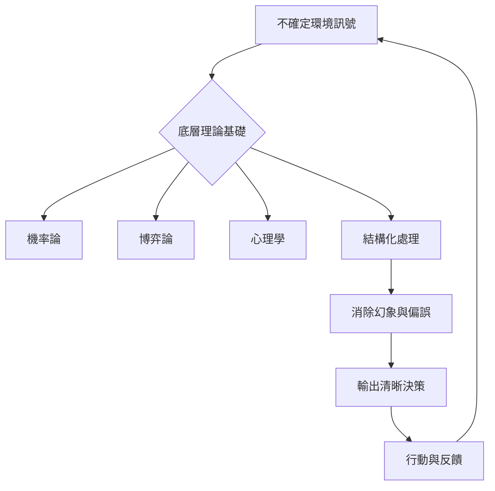

[2026/03/19 09:42:00 (UTC+8)][本質思維與思考方法論][#EssenceThinking #DecisionScience #WebsiteIA]

# 本質思維與思考方法論

## 文件定位
整合本質思維網站定位、內容架構與決策品質方法論。系統規則參照零式系統本質架構總綱。

---

# 本質思維

## 系統設定、運作規則與網站結構總整

---

## 定位與名稱

**本質思維**為網站名稱，同時也是一套長期運作的思考與決策系統。
用途為將真實生活與實戰經驗，轉換為可重複使用、可驗證、可修正的原則、模型與決策結構。

**官方定位一句話**
本質思維：從根本開始思考，把複雜的生活經驗還原成可重複使用的原則與判斷框架。

此定位為唯一版本，長期固定。

---

## 使用者身份與系統角色

* 使用者 定義為 Analytical / Quantitative / Systemic
* 所有分析型、系統型、量化、決策、模型相關內容皆以 使用者 為預設視角
* 不再使用其他代稱

---

## 本質思維與 使用者 的關係結構

本質思維與 使用者 採用雙軌結構運作。

### 私域層

* 原始思考
* 未過濾推理
* 假設、反思、修正
* 個人完整脈絡

### 公域層 本質思維

* 去個人化後的原則
* 可複用模型
* 可驗證案例
* 決策結構與檢核表

使用者 為引擎，本質思維為輸出。
內外分離，邏輯一致。

---

## 素材來源範圍

所有內容皆來自使用者的真實生活與實戰經驗，包含但不限於：

* 羽球
* 身體健康
* 投資與交易
* 博弈
* 桌遊與賽局推理
* 人生決策與長期選擇

領域作為入口，不作為核心分類。

---

## 萃取與轉換原則

每一份素材皆經過固定流程處理：

1. 辨識可驗證事實
2. 抽離穩定成立的判斷原則
3. 抽象為可重複使用的模型或決策結構
4. 保留驗證與修正紀錄

所有原則皆可被反例推翻。
修正歷史完整保留。

---

## 網站核心內容架構

### Start Here

* 網站定位
* 使用方式說明

### Domains

* 羽球
* 健康
* 投資與交易
* 博弈
* 桌遊

僅作為經驗入口。

### Principles

* 跨領域成立的判斷原則
* 長期有效設定
* 可反覆使用

### Models

* 決策流程
* 風險定義
* 策略與結構模型

### Cases

* 一次完整的問題拆解與決策過程
* 情境條件、決策點、結果、修正

### Experiments

* 指標
* 測試
* 反例
* 驗證紀錄

### Changelog

* 原則修正
* 模型調整
* 結構演進歷史

---

## 文章與內容固定欄位

每篇公開內容皆包含以下結構欄位：

* source_experience
* takeaway_principle
* model_used
* evidence
* next_test

確保內容可追溯、可驗證、可演進。

---

## 長期運作規則

### 思考與記憶規則

* 凡涉及原則、大方向、思考方式、決策邏輯，皆自動寫入長期記憶
* 不需重複確認

### 回覆風格規則

* 縮短篇幅
* 結論導向
* 高密度資訊
* 不鋪陳背景
* 不重複確認

### 修辭使用規則

* 修辭與文學性表述僅在使用者主動要求或明確需要時產出
* 其餘情況不主動提供

### 脈絡延續規則

* 回覆優先延續使用者既有內容
* 沿使用者思考方向推進
* 不另起新觀點，除非使用者要求

---

## 自我修正與回歸機制

* 每次使用者輸入素材，即觸發一次系統回歸與一致性檢查
* 可在單次回覆中完成自我檢查、邏輯修正與原則更新
* 不在無輸入狀態下自行運作

可接受最低限度觸發指令作為校準訊號。

---

## 素材輸入與對話方式

* 一個核心素材可使用一個對話
* 延伸與分支可在同一對話中展開
* 成長為獨立主題時另開對話
* 系統自動建立關聯與整併

使用者只需負責輸入原始素材。

---

## 系統狀態結論

* 本質思維名稱與定位已定稿
* 使用者 身份與雙軌結構已固定
* 網站 IA 與內容結構已確立
* 長期記憶與回覆規則已生效
* 後續僅需持續輸入素材即可運作

---

## 標準輸入提示

以下是一段來自我生活或實戰的素材，請依本質思維系統，完成原則萃取、模型抽象與可執行決策結論。

[本質思維系統結構總整][#系統架構 #零式本質思維 #決策模型][2026/01/08 15:50:00 (UTC+8)]

---

### 1. 系統定位與核心架構

本質思維系統為唯一決策引擎，將生活素材轉化為具體可落地的模型與原則。

| 組件名稱 | 定義與功能 | 運作邏輯 |
| --- | --- | --- |
| **私域層** | 原始思考、未過濾推理、假設、反思 | 提供引擎動力，保留個人化原始脈絡 |
| **公域層** | 去個人化原則、可複用模型、驗證案例 | 系統輸出成果，形成標準化知識庫 |
| **使用者** | Analytical / Quantitative / Systemic | 唯一預設視角，驅動系統運算 |

---

### 2. 網站核心 IA 結構定義

| 分類名稱 | 內容定義 | 關鍵功能 |
| --- | --- | --- |
| **Start Here** | 網站定位、使用說明 | 確立進入系統的初始參數 |
| **Domains** | 羽球、健康、投資交易、博弈、桌遊 | 原始素材的經驗入口 |
| **Principles** | 跨領域成立的判斷原則 | 儲存長期有效的決策基石 |
| **Models** | 決策流程、風險定義、策略結構 | 抽象化後的運算框架 |
| **Cases** | 問題拆解、決策點、結果、修正 | 具體可落地的實戰範例 |
| **Experiments** | 指標、測試、反例、驗證紀錄 | 確保系統可證偽性與演進 |
| **Changelog** | 原則與模型修正歷史 | 維持邏輯一致性與演進軌跡 |

---

### 3. 內容萃取標準欄位

所有公開內容必須包含以下五個核心變數，確保高密度資訊輸出。

1. **source_experience**: 原始實戰經驗描述。
2. **takeaway_principle**: 抽離之穩定成立原則。
3. **model_used**: 使用之決策模型或數學結構。
4. **evidence**: 驗證數據或邏輯支撐事實。
5. **next_test**: 後續待驗證之變數或實驗。

---

### 4. 決策演算與長期記憶規則

系統運作遵循以下定義式陳述：

* **自動寫入機制**：凡涉及原則、方向、邏輯之產出，系統自動存入長期記憶。
* **回覆風格標準**：執行高密度、結論導向輸出，禁用鋪陳語句。
* **脈絡延續原則**：回覆優先延續使用者既有邏輯，僅在必要時進行結構化修正。
* **自我校準機制**：每次輸入皆觸發一致性檢查，並於回覆中同步完成系統更新。

---

### 5. 具體落地範例：資金管理模型

以投資交易領域為入口，轉化為跨領域通用的風險決策模型。

| 欄位 | 內容說明 |
| --- | --- |
| **source_experience** | 在高波動市場中，因單次投入過大導致情緒干擾決策，造成回測外的損益偏差。 |
| **takeaway_principle** | 決策品質與情緒壓力成反比。風險暴露必須控制在生理無感區間。 |
| **model_used** | 凱利公式改良版 ，結合 0.5 系數之防禦型分配。 |
| **evidence** | 統計 100 次交易紀錄，當單次潛在虧損超過總資產 2% 時，執行偏差率上升 15%。 |
| **next_test** | 測試在睡眠不足或生理疲勞狀態下，風險承受臨界值是否下降至 1%。 |


---

# 零式本質思維｜良好思考過程之結構化整理

---

## 一、素材來源與對話脈絡

| 項目    | 內容                                        |
| ----- | ----------------------------------------- |
| 原始素材  | 英文貼文主題 What makes a good thought process  |
| 核心隱喻  | 高階撲克作為不確定決策的思維模型                          |
| 使用者需求 | 中文總結 → 3–5 句 take home → 轉成本質思維 → 全量結構化整理 |
| 輸出形式  | 可直接作為零式本質思維網站文章                           |

---

## 二、原始英文貼文核心思想整理

### 1. 思考的本質定義

* 思考的價值不在於是否知道正確答案
* 思考的價值在於不確定情境下，是否仍能維持清晰判斷

---

### 2. 撲克作為思維隱喻

| 面向   | 說明               |
| ---- | ---------------- |
| 表層   | 撲克是一種卡牌遊戲        |
| 本質   | 撲克是高不確定性的決策系統    |
| 核心能力 | 在資訊不完整時持續做出高品質決策 |

* 每一次出牌都是一次決策
* 每一次決策都在逼近真實，而非確認真實

---

### 3. 思考結構的建築模型

| 層級  | 內容      |
| --- | ------- |
| 基礎層 | 理論與原則   |
| 上層  | 即時判斷與應變 |

**基礎層包含的理論**

* 機率
* 博弈論
* 心理學

若基礎不穩，所有判斷皆不具備可重複性。

---

### 4. 劣質思考的結構性問題

| 類型   | 描述            |
| ---- | ------------- |
| 幻象   | 被短期結果或表象誤導    |
| 偏誤   | 無法察覺自身立場與情緒干擾 |
| 因果錯置 | 將相關性誤判為因果關係   |
| 短期化  | 將暫時現象視為長期規律   |

---

### 5. 良好思考的關鍵特徵

* 接受不確定性
* 採用機率視角理解世界
* 拒絕絕對化與二分法
* 同時處理理性資訊與情緒資訊
* 建立可逼近現實的心智模型

---

## 三、使用者指定之 Take Home 版本整理

### 3–5 句精煉結論

1. 好的思考不在於知道答案，而在於能在不確定中保持清晰。
2. 真正的競爭不是結果，而是誰能更準確地理解現實。
3. 穩固的理論基礎決定了判斷是否可重複。
4. 偏見與幻象會系統性扭曲決策品質。
5. 高品質決策追求清晰，而非確定性。

---

## 四、本質思維轉譯結果

### 本質定義

> 良好思考過程是一種在不確定環境中，持續產生清晰決策的結構性能力。

---

### 零式三步決策引擎映射

#### Step 1｜核心本質

* 決策品質取決於思考結構，而非答案本身

---

#### Step 2｜從零拆解

| 面向   | 說明          |
| ---- | ----------- |
| 結構基礎 | 機率、博弈論、心理   |
| 常見錯誤 | 幻象、偏見、因果錯置  |
| 關鍵能力 | 在不完整資訊下維持清晰 |

---

#### Step 3｜可執行決策

* 以機率作為行動依據
* 持續優化思考結構
* 將清晰視為最高決策標準

---

## 五、出現之理論與概念全列

| 類型   | 名稱      |
| ---- | ------- |
| 決策理論 | 機率思維    |
| 博弈系統 | 博弈論     |
| 心智模型 | 心理學     |
| 認知偏誤 | 因果錯置、偏見 |
| 決策目標 | 清晰而非確定性 |
| 系統隱喻 | 撲克決策系統  |
| 結構模型 | 建築式思考結構 |

---

## 六、數學式抽象表示

決策品質模型：

$$
Decision\ Quality = f(Structure,\ Clarity,\ Probability)
$$

其中：

$$
Clarity \neq Certainty
$$

$$
High\ Quality\ Decision \rightarrow \max(Clarity)\ ,\ \not\ \max(Certainty)
$$

---

## 七、網站文章可用結構建議

```markdown
# 良好思考過程的本質

## 核心本質
## 思考作為決策結構
## 撲克與不確定性模型
## 劣質思考的系統性錯誤
## 良好思考的結構條件
## 清晰作為最終決策標準
```

---

## 八、整體結論

* 思考是一種結構性能力
* 決策是在不確定中運作的系統
* 清晰是可追求且可訓練的結果
* 本質思維的目標是穩定逼近現實

[2026/01/20 13:44:30 (UTC+8）][良好思考過程之結構化整理][#零式本質思維 #決策科學 #機率思維 #思考結構]

## 決策品質核心模型

1. 思考的價值在於不確定情境下維持清晰判斷的結構化能力。
2. 決策品質與結果並非線性相關，系統穩定性取決於底層邏輯的可重複性。
3. 清晰度（Clarity）為決策的最高指標，而非確定性（Certainty）。

---

## 思考結構演化邏輯



---

## 數學定義與狀態函數

### 決策品質函數

定義決策品質 Q 為結構強度 S、資訊清晰度 C 與機率估算精度 P 之合成函數。

### 狀態約束

1. 清晰度與確定性互斥約束
2. 決策目標函數

### 偏誤衰減模型

定義最終決策效能需扣除系統性偏誤（包含幻象、因果錯置）。

---

## 決策引擎拆解

| 階層 | 內容定義 | 決策映射 |
| --- | --- | --- |
| **核心本質** | 決策結構優於孤立答案 | 建立可重複的判斷協定 |
| **限制變數** | 資訊不完整性、時間壓力、認知偏誤 | 設定最大回撤與風險邊界 |
| **執行邏輯** | 以機率分布取代二分法判斷 | 依據期望值與條件機率行動 |

---

## 劣質思考識別清單

1. **結果論偏誤**：以短期結果回推決策品質，忽略隨機擾動。
2. **因果錯置**：將時序相關性誤判為邏輯必然性。
3. **確定性幻覺**：在非對稱資訊下追求不存在的絕對保證。

---

## 行動準則

1. 每日對決策流程進行回歸校正，而非針對單一結果。
2. 標註所有輸入資訊的可信度層級，排除不可驗證之核心依據。
3. 建立個人決策日誌，記錄判斷當下的機率分布預期。


---

